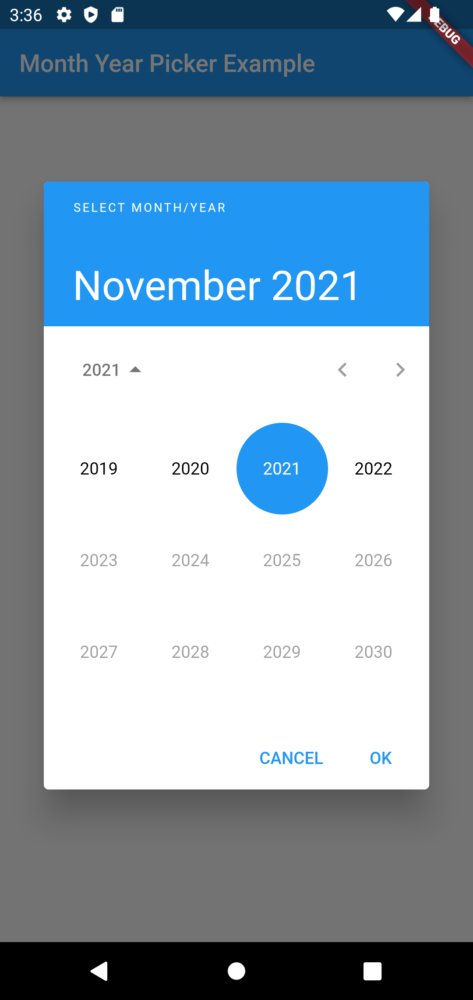
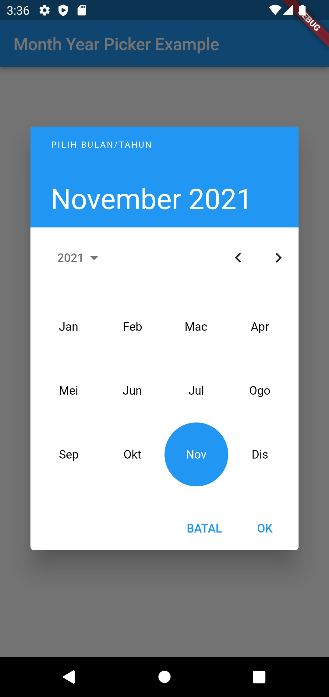
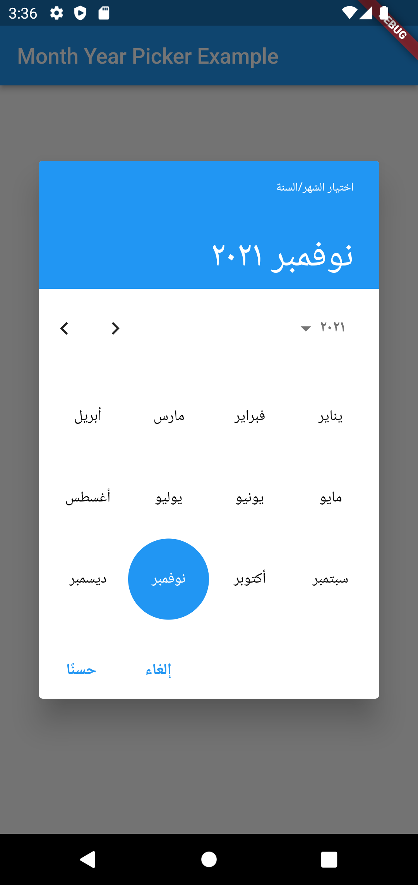
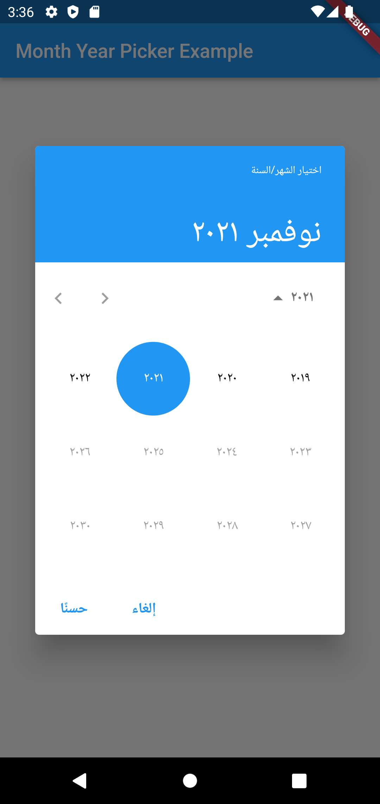
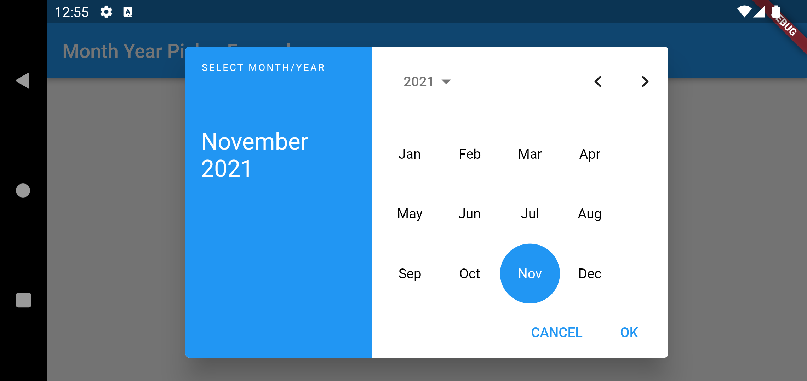
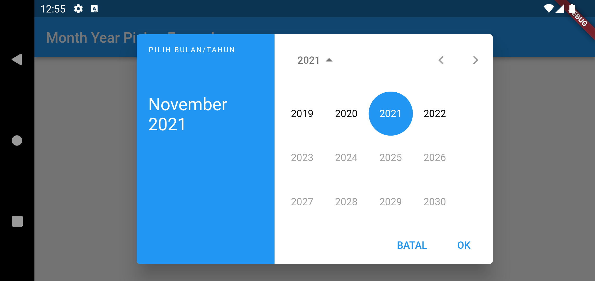
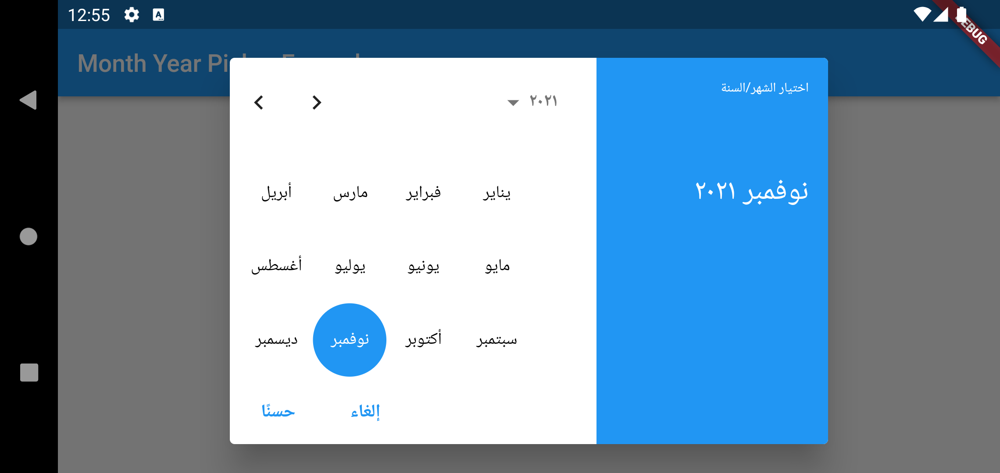
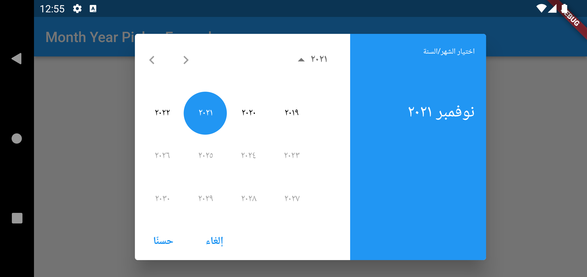

# Material Month/Year Picker

[][pub]


The month year picker inspired by the Flutter's date picker design.

## Quick Start

1. Open your `pubspec.yaml` file and add this entry:

    ```yaml
    month_year_picker: ^0.2.0+2
    ```

   OR just run `flutter pub add month_year_picker` using your preferred terminal app.

2. Then run `flutter pub get`.
3. Import this library into your code:

    ```dart
    import 'package:month_year_picker/month_year_picker.dart';
    ```
    Additionally, ensure your MaterialApp refers to the following `localizationsDelegates`:
    ```
        GlobalMaterialLocalizations.delegate,
        MonthYearPickerLocalizations.delegate,
    ```


4. Usage in code:

    ```dart
    final selected = await showMonthYearPicker(
      context: context,
      initialDate: DateTime.now(),
      firstDate: DateTime(2019),
      lastDate: DateTime(2023),
    );
    ```

## Parameters

| Parameter                      | Description                                                                                                                                                                                                                                                                      |
| ------------------------------ | -------------------------------------------------------------------------------------------------------------------------------------------------------------------------------------------------------------------------------------------------------------------------------- |
| `context`                      | Must not be `null`. Will be passed to the internal `showDialog` function call.                                                                                                                                                                                                   |
| `initialDate`                  | Must not be `null` and must fall between the `firstDate` and `lastDate`. The `initialDate` will be truncated to its `year` and `month` components. When the month/year picker is first displayed, it will show the month/year of the `initialDate`, with `initialDate` selected. |
| `firstDate`                    | Must not be `null`. The `firstDate` will be truncated to its `year` and `month` components. This is the earliest allowable month/year.                                                                                                                                           |
| `lastDate`                     | Must not be `null`. The `lastDate` will be truncated to its `year` and `month` components. This is the latest allowable month/year.                                                                                                                                              |
| `selectableMonthYearPredicate` | Can be `null`. The function to provide full control over which month/year can be selected. If provided, only the month/year that the `selectableMonthYearPredicate` returns `true` for will be selectable.                                                                       |
| `locale`                       | Can be `null`. If provided, will be used to set the locale for the month/year picker. Otherwise, it defaults to the ambient locale provided by `Localizations`.                                                                                                                  |
| `useRootNavigator`             | Can be `null`. Will be passed to the internal `showDialog` function call.                                                                                                                                                                                                        |
| `routeSettings`                | Can be `null`. Will be passed to the internal `showDialog` function call.                                                                                                                                                                                                        |
| `textDirection`                | Can be `null`. If provided, will be used to set the text direction for the month/year picker. Otherwise, it defaults to the ambient locale provided by `Directionality`.                                                                                                         |
| `builder`                      | Can be `null`. This parameter can be used to wrap the dialog widget with a parent widget.                                                                                                                                                                                        |
| `initialMonthYearPickerMode`   | Must not be `null`. Can be used to have the year picker initially appear in the `MonthYearPickerMode.year` mode. It defaults to the `MonthYearPickerMode.month` mode.                                                                                                            |

## Screenshots

| Mode                                                | Screenshot                                   |
| --------------------------------------------------- | -------------------------------------------- |
| Month picker in portrait mode with default locale.  |   |
| Year picker in portrait mode with default locale.   |    |
| Month picker in portrait mode with Malay locale.    |        |
| Year picker in portrait mode with Malay locale.     |         |
| Month picker in portrait mode with Arabic locale.   |        |
| Year picker in portrait mode with Arabic locale.    |         |
| Month picker in landscape mode with default locale. |  |
| Year picker in landscape mode with default locale.  |   |
| Month picker in landscape mode with Malay locale.   |       |
| Year picker in landscape mode with Malay locale.    |        |
| Month picker in landscape mode with Arabic locale.  |       |
| Year picker in landscape mode with Arabic locale.   |        |

## Building From Source

### Dependencies

1. Dart SDK version 2.17.0 or newer.
2. Flutter SDK version 3.0 or newer.

### Steps

1. Clone this git repo into your machine.
2. Run `.\gen_l10n.ps1` to re-generate the localised strings.

## Features and Bugs

Please file feature requests and bugs at the [issue tracker][tracker].

## License

This project is licensed under the MIT License - see the [LICENSE][license] file for details.

[pub]: https://pub.dartlang.org/packages/month_year_picker
[tracker]: https://github.com/zulfahmi93/dart_libpray/issues
[license]: LICENSE
